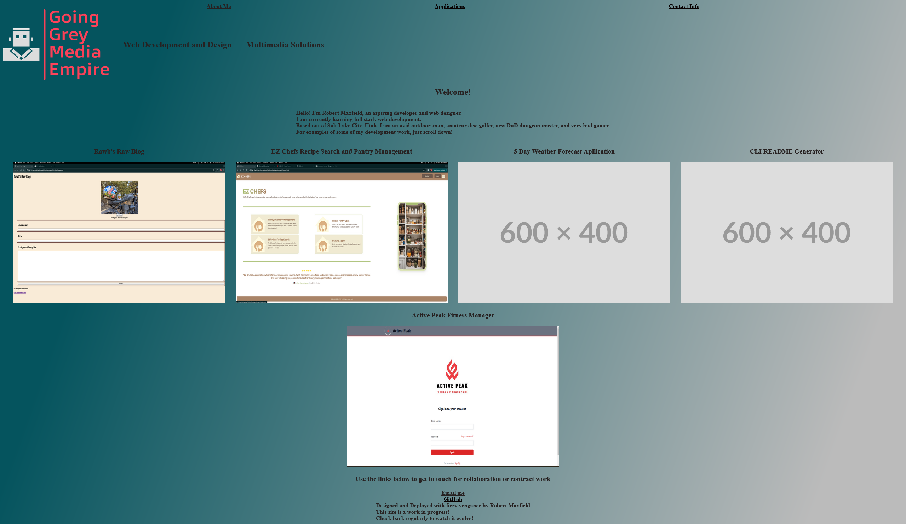

# Going Grey Media Empire landing webpage

    This README will document my development of a website to be used as a landing page for my development portfolio

## Description

    I intend to develop this application from the ground up with concepts being learned through a Full Stack Coding Bootcamp. As more concepts are learned, more features and adjustments will be made. This README will document all changes, additions, and deletions made to this ongoing project

## Table of Contents

- [Development Process](#development-process)
- [Screenshots and other Images](#screenshots)
- [Roadmap](#roadmap)
- [Resources Used](#resources)

## Development Process

    This application is of a relatively simple design. I begin by establishing a root directory on my system to hold all development files. Then, I created a GitHub repository to house all relevant files remotely. Once the root directory was linked to my remote repository, I began establishing the base file structure. As this project was meant to showcase my knowledge of HTML and CSS only, only an index and basic stylesheet were necessary. I used pen and paper to draw a rough mock-up of the intended application. Using these drawings as reference, I wrote the base code necessary to make a functioning web application. This application features a simple UI that includes a navigation bar with links to the various sections, a welcome message with some basic information about me, screenshots and links to some of my deployed applications, and a footer with links to contact me through email or view my work on GitHub. After the base code for the application was written, I began work on styling to attempt to create a pleasing interface for potential users. A simple color gradient background was used along with adjustments to font colors and weight to increase readability. A logo for a potential brand name was designed using a free version of the application on LOGO.com.

## Screenshots

- 
- 

## Roadmap

    -As I develop and deploy more applications, I intend to add screenshots and links to showcase that work.
    -Additional work will likely replace some of the displayed applications if determined to be a better showcase of    talents.
    -Styling will likely undergo multiple adjustments and tweaks as new skills are learned or improved.
    -Application will eventually migrate to a unique registered domain

## Resources

    -This application was developed using GitHub and VSCode.
    -Logo was desigined and dowloaded from LOGO.com and is intended only for this project.
    -Gardient color background was sourced from cssgradient.io
    -Assistance with CSS syntax was obtained from numerous free online forums, blog posts, and "Cheat Sheets" from across the internet.
    -All code was written by me with no assistance from any AI chatbots or similar services

